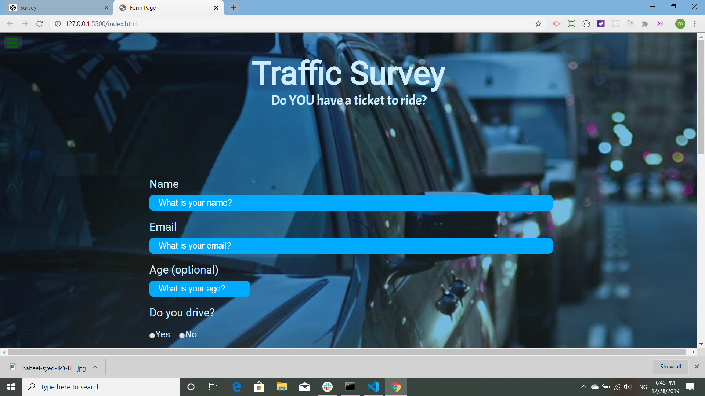
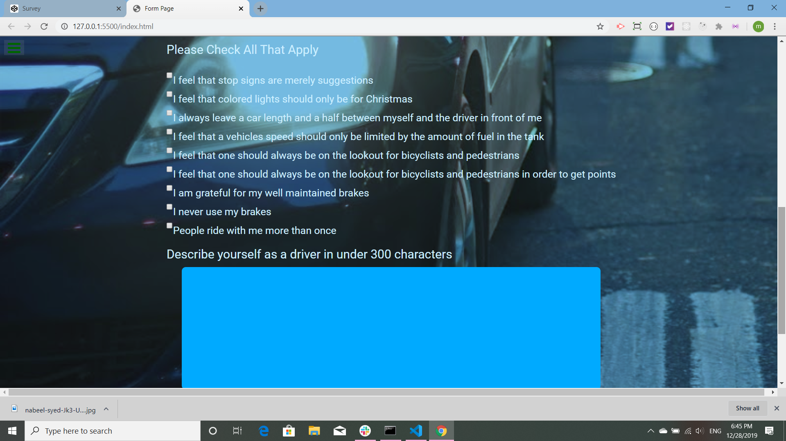
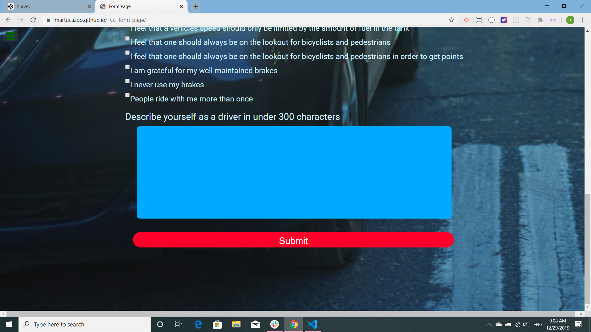

# FCC-form-page

This form page is an exercise for [The Free Code Camp](https://www.freecodecamp.org/). The Code is all mine. This exercise was originally made with [CodePen](https://codepen.io/martucazpo/pen/wvBeyzz). The background image is by Nabeel Syed and is from [Unsplash](https://unsplash.com/s/photos/car).

This is the header and the first few fields of the survey. The background was achieved by blending a color with the image.

These are the rest of the fields.

...And this is the big red submit button!

This form page is [published on Git Hub](https://martucazpo.github.io/FCC-form-page/) and on [CodePen](https://codepen.io/martucazpo/pen/wvBeyzz).